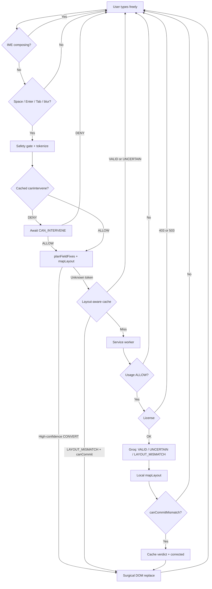

# AutoFix Layout — System Architecture

**Product:** Layfix (public brand). Repository and storage keys still use AutoFix Layout identifiers.  
**Type:** SaaS Chromium extension (Chrome and Microsoft Edge) + FastAPI microservice  
**Role:** Universal keyboard-layout mismatch engine  
**Document status:** Implemented architecture plus explicitly marked planned work.

This document is the source of truth. **Implemented** means code and tests exist. **Planned** is not claimed.

AutoFix restores text the user already intended when they typed on the wrong keyboard layout. It is not a translator, spellchecker, grammar checker, IME, or OS layout switcher.

---

## 1. System Overview

```text
AI / cache  →  VALID | UNCERTAIN | LAYOUT_MISMATCH(targetLayout)
Local engine →  mapLayout(token, sourceLayout, targetLayout)
```

`UNCERTAIN` is treated as `VALID` (do nothing). Groq never returns the corrected word. The replacement is a pure function of physical key positions.

A **language** (Arabic, English, Russian) is not a keyboard.  
A **layout** (`ar-101`, `en-US-qwerty`, `ru-standard`) is the physical key-position table. Every decision uses layout IDs. The popup may label a row by language.

Tokens are evaluated independently. Mixed-language sentences are the product, not an edge case.

### 1.1 Canonical proofs

| Typed on US QWERTY | Decision | Result |
| --- | --- | --- |
| `hsjo]lj` | `LAYOUT_MISMATCH` → `ar-101` | `استخدمت` |
| `React` | `VALID` | `React` |
| `td` (isolated) | `VALID` / uncertain | `td` |
| `td` after `hsjo]lj` | `LAYOUT_MISMATCH` → `ar-101` | `في` |
| `hgjwldl` | `LAYOUT_MISMATCH` → `ar-101` | `التصميم` |
| `lvpfh` | `LAYOUT_MISMATCH` → `ar-101` | `مرحبا` |
| `i\`h` | `LAYOUT_MISMATCH` → `ar-101` | `هذا` |
| `hkh` | `LAYOUT_MISMATCH` → `ar-101` | `انا` |
| `ghbdtn` (Russian enabled) | `LAYOUT_MISMATCH` → `ru-standard` | `привет` |

Reverse (Arabic 101 keys meant as English): `اثممخ بقهثىي اخص شقث غخع` → `hello friend how are you`. The shorter golden `اثممخ اخص شقث غخع` → `hello how are you` is the same path without `friend`.

`lvpf` (four letters) maps to `مرحب`, not `مرحبا`, so it stays. The complete physical sequence is `lvpfh`.

---

## 2. Hard Constraints

- Automatic evaluation only after Space / Enter / Tab / blur. Never per keystroke. Paste and drop are ignored.
- The Manifest V3 command `FIX_CURRENT_TEXT` is an explicit user action. It uses the same engines and the same no-op rules. It does not open the Manual Converter.
- IME `compositionstart` / `compositionend`: no evaluation while composing.
- Never change the OS layout. Never lock a field to one language.
- User `enabledLayouts` is the only candidate set. One layout → no automatic remap. Planned IDs are never searched.
- False correction is worse than a miss. Ambiguity / `UNCERTAIN` → do nothing.
- Failures (network, license, stale snapshot, unknown layout, incomplete map, exhausted Free allowance) → do nothing.
- Groq and Lemon Squeezy secrets stay on the server.
- Never send secrets, credentials, URLs, or code-region tokens to the classifier.
- Comma and period are **not** default English word boundaries: on Arabic 101 those keys produce letters (`و`, `ز`).

---

## 3. Data Flow



The service worker owns the network. The content script is DOM-only (no fetch). The local converter (`convertManualText` / `mapLayoutText`) may be imported there because it is pure and synchronous. The classifier never transforms.

When the cached `canIntervene` flag is already ALLOW, `applyLocalFixes` runs in the same Space/Enter/Tab/blur turn. `CAN_INTERVENE` refresh and `CHECK_WORD` stay asynchronous and must not delay that local write. Typing itself is never blocked. See [`REAL_TIME_ARCHITECTURE_AUDIT.md`](REAL_TIME_ARCHITECTURE_AUDIT.md).

---

## 4. Repository Structure

```text
autofix-layout/
├── ARCHITECTURE.md              this document
├── DESIGN_SYSTEM.md             popup + site visual rules
├── README.md
├── site/                        marketing + legal pages (not shipped in the extension)
├── manifest.json                MV3: storage, activeTab, clipboardWrite, commands, localhost hosts
├── build/                       Chrome / Edge output targets (same manifest)
├── vite.config.ts               @crxjs/vite-plugin; injects VITE_API_BASE_URL host
├── src/
│   ├── content_script.ts        DOM-only: boundary, snapshot, hot cache, write, speed box, shortcut
│   ├── content/
│   │   ├── speedBox.ts          page overlay; same convertManualText / mapLayoutText
│   │   └── fixCurrentText.ts    selection / caret-token targeting for FIX_CURRENT_TEXT
│   ├── background.ts            cache, API, license, profile, messages, commands
│   ├── background/
│   │   └── commands.ts          active-tab FIX_CURRENT_TEXT dispatch
│   ├── messaging.ts             CHECK_WORD / FIX_CURRENT_TEXT / SET_PROFILE / history / pause
│   ├── runtime.ts               context-invalidated / alive checks
│   ├── brand.ts                 name, tagline, layout copy
│   ├── qwerty_ar_map.ts         deprecated shim → mapLayout
│   ├── layouts/                 product core (mapLayout + convertManualText)
│   │   ├── catalog.json         implemented vs planned IDs (shared with backend)
│   │   ├── types.ts             LayoutId, KeyboardLayout, ClassificationResult
│   │   ├── registry.ts          physical-key tables + mapLayout + goldens
│   │   ├── en-US-qwerty.ts
│   │   ├── ar-101.ts
│   │   ├── ru-standard.ts
│   │   ├── heuristics.ts        infer source, hint, canCommitMismatch
│   │   ├── sentence.ts          planFieldFixes (token-level)
│   │   ├── profile.ts           DEFAULT_PROFILE, candidateTargets, isEnabledLayout
│   │   ├── convert.ts           manual remap (popup + speed box; same mapLayout engine)
│   │   ├── languages.ts         language-tag → layout ID (unused for auto-enable)
│   │   ├── index.ts             public barrel
│   │   └── lexicons/            ar-words.ts, en-words.ts (confidence, not proof)
│   ├── safety/
│   │   ├── tokenize.ts          whitespace split; peel trail punct; keep ] `
│   │   ├── tokenKind.ts         secrets, URLs, emails, identifiers, digits
│   │   ├── fields.ts            protected contexts (password, OTP, payment, username, email, URL, code)
│   │   ├── domains.ts           excluded hosts
│   │   ├── markdown.ts          fences / inline ticks
│   │   └── privacy.ts           analyze-word allowlist + safeContext
│   ├── dom/
│   │   ├── types.ts             snapshot shape
│   │   ├── read.ts              field text, caret, offsets
│   │   ├── verify.ts            stale-write discard
│   │   ├── write.ts             native setter / contenteditable Range
│   │   └── composition.ts       IME composition depth
│   ├── cache/
│   │   ├── key.ts               NFC + sorted candidates; no license
│   │   ├── lru.ts               in-memory TTL LRU
│   │   ├── store.ts             memory + persist wordCacheV2
│   │   ├── coalesce.ts          in-flight dedupe
│   │   ├── hotPath.ts           content-script immediate decision
│   │   ├── record.ts            VALID | LAYOUT_MISMATCH only
│   │   └── metrics.ts           cacheHit / miss / domReplace / swMessage
│   ├── entitlement/             trial, Free balance, refill, Pro license cache
│   ├── profile/
│   │   ├── types.ts             UserProfile, history, pause, storage keys
│   │   ├── normalize.ts         migrate / recover
│   │   ├── exceptions.ts        never-correct tokens
│   │   ├── history.ts           local token → replacement list
│   │   └── learn.ts             2 reverts → auto-exception
│   ├── popup/                   feature toggles, layouts, manual converter, trust
│   ├── testpad/                 options page playground
│   ├── ui/                      Mark + design tokens
│   └── adversarial/             accuracy, races, mixed-language tests
├── backend/
│   ├── main.py                  routes, license, Groq
│   ├── settings.py              env, CORS, TTLs, rate limits
│   ├── classification.py        parse / prompt / catalog / cache version
│   ├── ratelimit.py             in-process sliding window
│   ├── observability.py         request IDs, security headers, access logs
│   └── tests/
├── dist/chrome/                 unpacked Chrome package (`npm run build:chrome`)
└── dist/edge/                   unpacked Edge package (`npm run build:edge`)
```

Adding a **verified** layout requires: a module under `src/layouts/`, an entry in `catalog.json`, registration in `registry.ts` + `LayoutId`, and golden tests. It must not require rewriting DOM transport, FastAPI licensing, or the popup shell.

---

## 5. Keyboard Layout Registry

**Implemented (tested letter-row goldens):**

| ID | Language | Name |
| --- | --- | --- |
| `en-US-qwerty` | en | US QWERTY (default source) |
| `ar-101` | ar | Arabic 101 |
| `ru-standard` | ru | Russian ЙЦУКЕН |
| `de-qwertz` | de | German QWERTZ |
| `fr-azerty` | fr | French AZERTY |
| `tr-q` | tr | Turkish Q |
| `he-standard` | he | Hebrew |
| `el-standard` | el | Greek |
| `es-latam` | es | Spanish Latin American |
| `it-standard` | it | Italian |
| `pt-abnt` | pt | Portuguese Brazil |
| `uk-standard` | uk | Ukrainian |
| `fa-standard` | fa | Persian |

**Out of scope:** IME languages (`zh-pinyin`, `ja-ime`, `ko-ime`). Those are not 1:1 physical-key layouts. AutoFix remaps keyboards, not spoken languages.

```ts
type KeyboardLayout = {
  id: LayoutId
  language: string
  name: string
  metadata: { direction: 'ltr' | 'rtl'; hasAltGr: boolean; variant?: string }
  keys: Partial<Record<PhysicalKeyId, {
    unshifted: string
    shifted: string
    altGr?: string
  }>>
}
```

`mapLayout(token, source, target)` finds the physical key and modifier level that produced each source character and emits the target layout’s output for that same key and level. Multi-character outputs (`b` → `لا`) are first-class. Unknown layouts or incomplete maps return `null`.

Default user profile:

```json
{
  "enabled": true,
  "manualConversionEnabled": true,
  "sourceLayout": "en-US-qwerty",
  "enabledLayouts": ["en-US-qwerty", "ar-101"],
  "excludedDomains": [],
  "personalExceptions": [],
  "pausedUntil": 0
}
```

`ru-standard` is opt-in in the popup. Browser-language auto-detect does **not** add layouts. A user may disable Arabic and keep English only; then no remap runs.

Deprecated: `mapEnKeysToArabic` wraps `mapLayout(..., 'en-US-qwerty', 'ar-101')`. New code must call `mapLayout`.

---

## 6. User Profile and Popup

Storage (`src/profile/types.ts`):

| Key | Area | Contents |
| --- | --- | --- |
| `autofixProfile` | local | `enabled`, `manualConversionEnabled`, `directShortcutEnabled`, layouts, exclusions, exceptions, `pausedUntil` |
| `autofixEvents` | local | accepted / ignored / reverted (2 reverts → exception) |
| `autofixHistory` | local | recent `token → replacement` (max 40) |
| `wordCacheV2` | local | classification cache |
| `licenseKey` | sync | user license only |
| `autofixFirstActivatedAt` | sync | trial start; survives reinstall on a signed-in Chrome profile |
| `autofixUsage` | local | usage balance, refill/session timestamps, last `canIntervene` |
| `autofixLicenseCache` | local | last server-verified license result + timestamp — never a client `isPro` flag |
| `enabled`, `layoutProfile`, `excludedDomains` | sync | non-personal mirror for migration |
| `languagesAutoDetected` | sync | install flag only — does **not** add layouts |

`layoutsFromLanguages` still maps `en` / `ar` / `ru` tags to layout IDs for tests. The service worker’s `detectUserLayouts` sets the flag and stops. Browser language never expands `enabledLayouts`.

Fields larger than **2 000** characters or **48** tokens are skipped (oversized / paste-like).

Service-worker messages (`src/messaging.ts`): `CHECK_WORD` (optional `explicit` for the shortcut), `GET_STATUS`, `SET_ENABLED`, `SET_MANUAL_CONVERSION`, `SET_DIRECT_SHORTCUT`, `SET_PROFILE`, `SET_EXCLUDED_DOMAINS`, `ADD_EXCEPTION` / `REMOVE_EXCEPTION`, `RECORD_CORRECTION`, `PAUSE_TEMPORARILY`, `ADD_EXCLUDED_DOMAIN` / `REMOVE_EXCLUDED_DOMAIN`, `CLEAR_HISTORY`, `ACTIVATE_LICENSE`, `NOTE_USAGE_ACTIVITY`, `CAN_INTERVENE`. The service worker also handles the Manifest V3 command `FIX_CURRENT_TEXT` and forwards that name as a tab message. The content script sends `CHECK_WORD`, throttled `NOTE_USAGE_ACTIVITY`, and `CAN_INTERVENE`. It does not compute trial, refill, or license rules. Field text never travels through the service worker on the shortcut path.

Personal exceptions and history are never uploaded. No model is trained.

Popup (`src/popup/`): light consumer shell. Header + Active/Paused/Off, one-line product sentence, independent **Automatic correction**, **Manual converter**, and **Keyboard shortcut** switches, the assigned command (or “Not assigned”), a link to the browser’s official shortcut settings, selected languages only (`+ Add language`), local converter (instant, click result to copy), secondary Trial/Free/Pro card, collapsed Settings (never-correct, skip site, local history, license, playground). No custom shortcut editor. No API/engine footer. No page banners. Automatic correction needs **two layouts**. Manual conversion text is ephemeral — never stored or uploaded.

Marketing site (`site/`): install-focused landing page, pricing, FAQ, privacy, terms, refunds (Lemon Squeezy), support. Store copy lives in `site/STORE_LISTING.md`. Visual rules: `DESIGN_SYSTEM.md`. Public price: `src/pricing.ts` (`$29 / year`).

The same converter also opens as a centered page speed box (`Ctrl/⌘+Shift+L`) from the content script when `manualConversionEnabled` is on. Opening it does not rewrite the page field.

---

## 7. Classifier Contract

Extension type:

```ts
type ClassificationResult =
  | { kind: "VALID" }
  | { kind: "LAYOUT_MISMATCH"; targetLayout: LayoutId }
```

Backend JSON:

```json
{ "result": { "kind": "VALID" } }
{ "result": { "kind": "UNCERTAIN" } }
{ "result": { "kind": "LAYOUT_MISMATCH", "target_layout": "ar-101" } }
```

`UNCERTAIN` parses to `VALID`. The target must be in `catalog.json` **and** the request’s `candidate_layouts`. Arbitrary model text → `VALID`. Leftover `AR_GIB` / `EN` strings still map only when those IDs are candidates.

The system prompt lists mismatch examples **only** for layouts in the request. Groq is told: classify only; never translate; never emit the corrected word; if unsure, `UNCERTAIN` or `VALID`.

---

## 8. API

`POST /api/analyze-word`

```json
{
  "license_key": "optional-in-dev",
  "word": "hsjo]lj",
  "context": "hsjo]lj React",
  "source_layout": "en-US-qwerty",
  "candidate_layouts": ["en-US-qwerty", "ar-101"]
}
```

Missing `candidate_layouts` defaults to English + Arabic (older clients). Payload allowlist: those five fields. `safeContext` strips unsafe tokens and caps at 200 characters / last four words.

`GET /health` — `{ "status": "ok" }` liveness.  
`GET /api/health` — model, `license_required`, implemented layouts from `catalog.json`.  
`POST /api/license/activate` — Lemon Squeezy validate.

Analyze and license routes are rate-limited in-process (configurable per IP). Over-limit returns `429 {"detail":"rate_limited"}`. The extension treats non-200 classifier responses as no-op.

Every response includes `X-Request-ID`. Access logs record request ID, path, status, latency, cache hit/miss, and license/rate-limit category. They never record the analyzed token.

Extension default API base: `VITE_API_BASE_URL` or `http://127.0.0.1:8003`.

---

## 9. Caching

```text
boundary → in-memory cache → immediate write if known
```

Misses are fire-and-forget to the service worker. Duplicate in-flight keys coalesce.

| Layer | Where | Notes |
| --- | --- | --- |
| Hot replica | content script memory | hydrated from `wordCacheV2` |
| Persistent | `chrome.storage.local` `wordCacheV2` | max 5 000 |
| Memory LRU | service worker | TTL 24 h, max 2 000 |
| License valid | backend | 900 s, 2 000 |
| License invalid | backend | 90 s (60–120), 2 000 |
| Classification | backend | 86 400 s, 10 000 |

Key: `CLASSIFIER_VERSION | NFC(token).lower | sourceLayout | sorted(candidates) [| ctx:…]`  
Context only for tokens ≤ 3 characters. No license in the key. Failures do not write the cache. Cache-hit target **< 5 ms**. Bump `CLASSIFIER_VERSION` when the prompt or allowed enum changes.

---

## 10. DOM Replacement

Snapshot: `{ element, kind, originalWord, wordStart, wordEnd, caret, timestamp, generation }`.

Before write: connected, same node, range exists, slice === original, caret not inside word, no selection overlap, `mapLayout` still matches. Any failure discards the write.

- `input` / `textarea`: native prototype setter + `InputEvent insertReplacementText` + caret restore  
- `contenteditable`: TreeWalker / Range / `normalize()` + caret restore  

Supported hosts: generic `input`, `textarea`, `contenteditable`. Docs / Notion are out of scope.

No custom undo stack. Recovery: browser undo, or **Never correct this**.

---

## 11. Accuracy Rules

A possible `mapLayout` result is evidence, not permission to write.

| Outcome | Meaning |
| --- | --- |
| `KEEP` / `VALID` | leave the token |
| `CONVERT(target)` | remap if `canCommitMismatch` |
| `UNCERTAIN` | `KEEP` |

- **Candidates:** only `enabledLayouts`.  
- **Source/target:** any pair in that set. English is not hardcoded as the only source.  
- **Token-level:** no sentence language lock.  
- **Short tokens:** 1–2 letters almost never convert (`td` / `ig` need a sibling that already looks like Arabic-on-QWERTY, or Arabic already in the field). Isolated `td` / `lk` stay. `gh` stays.  
- **3+ letters:** convert only if the physical remap is a known target-lexicon word. Arabic-letter punctuation (`]`, `` ` ``, `;` as ك) stays inside the token; it is not a write permission. A semicolon after an already-committing token stays punctuation (`hsjo]lj;` → `استخدمت;`). `;dt` / `phg;` remap to `كيف` / `حالك`. Lone `;` and `;rm` still skip as shell.  
- **Already correct:** real English, real Arabic, brands, `camelCase` / `PascalCase` / `snake_case`, `ALL_CAPS`, `v2` / `API2`, pure digits, URLs, emails, secrets → `KEEP`.  
- **Lexicons** support confidence; they are not proof and not spelling correction.  
- **Unicode:** NFC for comparison and cache keys. The DOM write is the mapped string.  
- **IME / races:** composition blocked; stale snapshots no-op.

`canCommitMismatch(profile, word, target, corrected, context)` requires the target to be enabled **and** `shouldCommitMismatch`.

---

## 12. Security and Licensing

```text
extension license_key → FastAPI → Lemon Squeezy (TTL) → Groq
```

`GROQ_API_KEY` and `LEMON_SQUEEZY_API_KEY` never ship in the extension.

| Condition | API |
| --- | --- |
| `DEV_SKIP_LICENSE=true` | license skipped (local only) |
| flag off, no Lemon key | `503 license_unconfigured` |
| invalid key | `403` |

CORS default is not `*`. Production refuses `CORS_ORIGINS=*`. Chrome-extension origins via regex, optionally pinned with `EXTENSION_IDS`. Extra website origins from `CORS_ORIGINS`.

MV3 permissions: `storage`, `activeTab`. Hosts: localhost:8000–8003 plus `VITE_API_BASE_URL` origin at build time.

**Planned:** instance-bound Lemon Squeezy licenses.

### 12.1 Trial, Free allowance, and Pro

**Implemented.** Monetization lives in `src/entitlement/`. Detection, `mapLayout`, the manual converter, and DOM writes are unchanged. The only new product question is: *can AutoFix intervene now?*

| State | Automatic intervention | Manual converter | Usage UI |
| --- | --- | --- | --- |
| **TRIAL** | Unlimited for 7 days from first activation | Available | Status only. No limit copy, no upgrade pressure |
| **FREE** | Active-use allowance, default 2 hours (`FREE_MAX_BALANCE_MS`) | Available, does not consume the allowance | Remaining time + next refill + Upgrade |
| **PRO** | Unlimited after Lemon Squeezy activate | Available | “Unlimited usage” |

Trial starts at the first successful service-worker initialization (`firstActivatedAt`), not the first popup open or first correction. The stamp is written to `chrome.storage.sync` so a reinstall on the same Chrome profile does not mint a new trial. Popup reopen, browser restart, and service-worker restart reuse the same timestamps.

After the trial, Free users consume **active session time** while they type in a supported field and automatic intervention is live. Heartbeats are throttled (`ACTIVITY_HEARTBEAT_MS`). Gaps longer than `ACTIVE_IDLE_TIMEOUT_MS` (60s) do not consume. Idle browser time does not consume. Failed / ignored / UNCERTAIN tokens do not consume. Multiple tabs share one service-worker session — overlapping heartbeats do not double-count.

Refill is computed from `lastRefillAt`, not a running `setInterval`: every `REFILL_INTERVAL_MS` (5 hours) add `REFILL_AMOUNT_MS` (30 minutes), capped at 2 hours, never below zero. Long sleep applies every elapsed interval at once, then clamps.

When the Free balance hits zero the extension becomes **passive**: no webpage rewrite, no blocked keystrokes, no injected banners. The user can still type and still use the local converter. Popup shows that automatic correction is paused and when the next refill lands.

Pro is only the last **server-verified** license cache (`autofixLicenseCache`), aligned with the existing Lemon activate / TTL path. A client-written `isPro: true` is ignored. Offline, a previously valid cache stays Pro so local conversion is not cut off. `DEV_SKIP_LICENSE` and secrets stay on the server. Chrome and Edge use the same activate API and the same key; storage is per browser profile, so Pro does not jump between browsers until the user activates that key again.

Existing installs that have no usage record receive a fresh 7-day trial on first entitlement init so they are not dropped onto an expired or zero balance.

Constants live in `src/entitlement/config.ts` only.

---

## 13. Tech Stack and Tests

| Layer | Choice |
| --- | --- |
| Extension | TypeScript, React popup, Vite, `@crxjs/vite-plugin`, MV3 |
| Backend | FastAPI, AsyncGroq, cachetools, `catalog.json` |
| Payments | Lemon Squeezy |
| Tests | Vitest (`src/**/*.test.ts`), pytest (`backend/tests`) |

Test groups: layout goldens (`mapLayout.test.ts`), manual converter (`convert.test.ts`), page speed box (`speedBox.test.ts`), direct shortcut targeting / command dispatch (`fixCurrentText.test.ts`, `commands.test.ts`), entitlement / trial / refill (`entitlement.test.ts`), cache, profile, safety, DOM replace, races (`dom-races.test.ts`), adversarial mixed-language, accuracy hardening (`accuracy.test.ts`), classification / CORS / license / rate limits (`backend/tests`).

```bash
npm test          # vitest
npm run build:chrome   # tsc + vite → dist/chrome
npm run build:edge     # same source → dist/edge
cd backend && python3 -m pytest
```

---

## 14. Non-Goals

- LLM translation or invented replacement text  
- Spelling / grammar / autocomplete  
- Per-key rewrite, IME, or OS layout switching  
- Claiming planned layouts as implemented  
- Docs / Notion adapters, custom undo stacks  
- Full programming-language parsing  
- Automatic language discovery that enables extra layouts  
- Training a model from correction events  

---

## 15. Glossary

| Term | Meaning |
| --- | --- |
| **VALID / KEEP** | Token stands as typed. |
| **UNCERTAIN** | Not enough evidence. Same as KEEP. |
| **LAYOUT_MISMATCH / CONVERT** | Same physical keys, wrong layout. Remap locally. |
| **Layout** | Physical key table, not a language name. |
| **Source layout** | Layout that produced the glyphs now in the field. |
| **Candidate layouts** | User-enabled search space. |
| **Snapshot** | Range + generation captured at the boundary. |
| **Safety gate** | Local skip before cache or Groq. |
| **Personal exception** | Local never-correct token. |
| **Correction history** | Local list only. Never uploaded. |
| **Temporary pause** | `pausedUntil`. Direct intervention off until it expires. Manual conversion is unaffected. |
| **Direct text intervention** | `enabled` + pause. Automatic content-script DOM remap while typing. |
| **Direct shortcut** | Manifest command `FIX_CURRENT_TEXT`. Explicit fix of the selected or current token. Independent of `enabled` and `manualConversionEnabled`. Same engines. Does not open the Manual Converter. |
| **Manual conversion** | `manualConversionEnabled`. Popup or page speed box (`Ctrl/⌘+Shift+L`). Same `mapLayoutText`. Local only. Does not consume the Free automatic-usage allowance. |
| **TRIAL / FREE / PRO** | Entitlement states. Only automatic webpage intervention is limited after the trial. |
| **Active usage** | Time the user is typing in a supported field while automatic intervention is live. Idle time does not count. |

---

## 16. Implementation Status

**Implemented:** layout registry (EN / AR / RU plus additional physical-key tables); bidirectional Arabic remap; Russian high-confidence `ghbdtn`; token-level mixed sentences; user-enabled candidate constraint; conservative short-token and identifier gates; safety tokenizer; IME composition lock; snapshot / race-safe DOM writes; memory + persist + coalesced cache; privacy allowlist; local profile, exceptions, history, pause; independent feature toggles; local popup manual converter and page speed box (`mapLayoutText` / `convertManualText`); Manifest V3 `FIX_CURRENT_TEXT` direct shortcut (selection / current-token, same `planFieldFixes` + `mapLayout`); 7-day trial then Free active-use allowance with persisted refill; Pro via existing Lemon activate cache; fail-closed licensing; restricted CORS; in-process rate limits; request IDs; `/health`; classifier cache versioning; build-time production host injection; popup trust UI; tests listed above.

Hosting procedure: [`DEPLOYMENT.md`](DEPLOYMENT.md). Readiness status: [`PRODUCTION_READINESS_REPORT.md`](PRODUCTION_READINESS_REPORT.md).

**Planned:** more regional variants; Russian/Hebrew/Greek lexicons for automatic commit; instance-bound licenses; Docs / Notion adapters; paste evaluation; a named production API hostname. IME languages stay out of scope.

---

## 17. Manual Conversion

AutoFix has two **manual** entry points, automatic intervention, and an explicit **direct shortcut**. All conversion uses the **same** deterministic engine (`mapLayout` / `mapLayoutText` / `convertManualText` / `planFieldFixes`). There is no second mapper. The shortcut is not a translator.

```text
Automatic:
  Content script → safety → planner / cache / Groq classify → mapLayout → DOM

Direct shortcut:
  Commands API → service worker → FIX_CURRENT_TEXT → content script
    → focused field → selection or caret token
    → existing planner / classifier / mapLayout → surgical DOM replace

Manual:
  Popup → sourceLayout + targetLayout (user-selected) → convertManualText → output
  Page speed box (Ctrl/⌘+Shift+L) → same convertManualText → overlay output
```

**Independent toggles** (persisted on `autofixProfile`):

| Flag | Default | Effect |
| --- | --- | --- |
| `enabled` | true | Automatic page intervention. If off or paused, Space/Enter/Tab/blur do not rewrite. Implicit `CHECK_WORD` returns `VALID`. |
| `manualConversionEnabled` | true | Shows the popup conversion box and allows the page speed box. Does not enable page rewriting. |
| `directShortcutEnabled` | true | Allows the Manifest command to rewrite the focused field. Independent of the other two flags. |

Any flag may be on while the others are off. Turning all three off leaves layouts, license, and settings available. Pause (`pausedUntil`) applies only to automatic intervention. The shortcut still works when automatic is off or paused, subject to entitlement (`CAN_INTERVENE`). Implicit `CHECK_WORD` stays gated by `enabled`; shortcut classification sends `explicit: true`.

**Shortcut:** `Ctrl/⌘+Shift+L` (physical `KeyL`, so it still works on Arabic/Russian layouts). Ignored while IME is composing. Does not intercept ordinary typing. If manual conversion is off, the shortcut is a no-op and does not open the box. Esc or click-outside closes. Input/output are ephemeral — cleared on close, never stored.

**Speed box:** Shadow DOM overlay, ~420px, centered, high z-index, dark tokens. Opening it must not rewrite the page field. Direct text intervention stays independent.

**UI:** source selector, swap, target selector, input, result surface. No Convert button. No Copy button. No paste button. Empty result shows a placeholder; a result is click-to-copy. Input/output text is not stored. Popup converter stays; the speed box is the same engine, not a second product.

**Selectors:** only `enabledLayouts` that exist in the registry. Defaults: `sourceLayout` from the profile (English) → first other enabled layout (Arabic). Invalid or planned IDs are dropped. Same source and target → output equals input.

**Conversion:** on every input or selector change, locally and synchronously. Whitespace, line breaks, and tabs are preserved. Unmapped characters are left as typed. Unsupported pairs do not invent output. `hello` English → Arabic is `اثممخ`, never `مرحبا`.

---

## 18. Direct Keyboard Shortcut

The shortcut is an explicit “fix this text” action. It is **not** the Manual Converter and must never open the speed box or popup converter.

```text
Browser Commands API
        ↓
Service worker (active tab only; no field text)
        ↓
FIX_CURRENT_TEXT
        ↓
Content script
        ↓
Focused editing context (input / textarea / contenteditable)
        ↓
Selection (priority) or current token at the caret
        ↓
Existing planFieldFixes / localClassificationHint / CHECK_WORD / mapLayout
        ↓
Surgical commitReplacement (allowActiveEdit) or no-op
```

**Default suggested key:** `Ctrl+Shift+P` / `Command+Shift+P` (`Ctrl/⌘+Shift+P`). Chosen to avoid the existing speed-box chord (`Ctrl/⌘+Shift+L`) and common browser chords (address bar, DevTools, incognito, reopen tab). The user changes it in `chrome://extensions/shortcuts` or `edge://extensions/shortcuts`. The popup shows the assigned shortcut from `chrome.commands.getAll()`, or “Not assigned” if the browser left it empty.

**Selection** has priority. Only tokens fully inside the selected range are evaluated. Correct-language tokens stay. Uncertain tokens stay. If nothing is selected, the tokenizer’s current token around the caret is the only target. Caret on whitespace, no focused field, password/OTP/code/console fields, excluded hosts, empty tokens, URLs, emails, digits, and technical identifiers → no-op. No modal, no error dialog.

**Independence:** works when Automatic correction is off or paused. Works when Manual converter is off. `directShortcutEnabled` off disables only this command. Free-limit / network / 429 / stale snapshot / unsupported editor → no-op; original text stays.

**Async safety:** classifier calls reuse `CHECK_WORD` with `explicit: true` and the existing snapshot / generation / text-mismatch discard. The page is never blocked while a request is in flight.

**Undo:** value fields dispatch `insertReplacementText` through the existing writer. There is no second undo stack. Native undo depends on the host page and was not claimed for every editor.

**Not supported unless already implemented and tested:** Google Docs canvas, Notion/Slack custom editors that are not a standard input/textarea/contenteditable the existing writer can update. Those contexts no-op.

Evidence and remaining gaps: [`DIRECT_SHORTCUT_TEST_REPORT.md`](DIRECT_SHORTCUT_TEST_REPORT.md).

